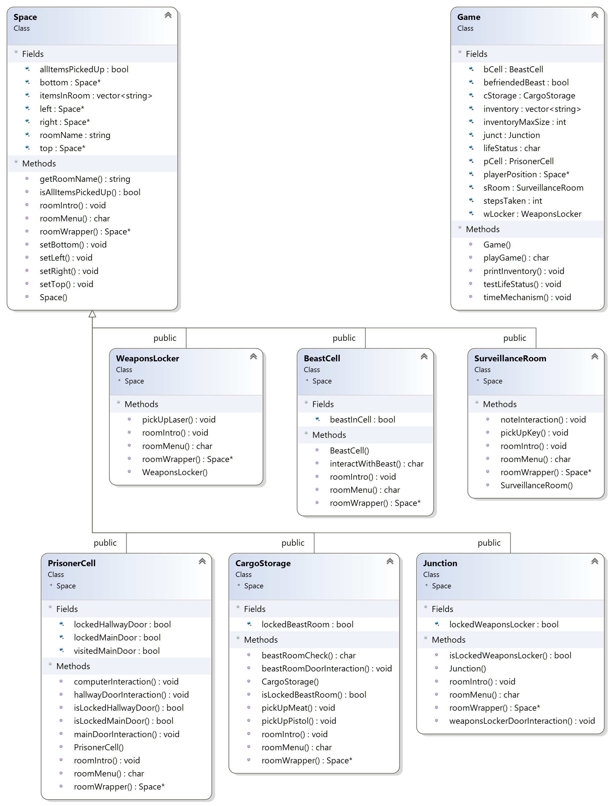

# Text-Based Adventure Game: ESCAPE: STARSHIP CRASH!

ESCAPE: STARSHIP CRASH! is a simple text-based adventure game coded in C++. The objective of the game is to escape the Starship before time runs out. The player travels through various rooms and interacts with items and events to achieve this objective. The gameplay features action menus at each turn where the player can select an action to perform.

## Instructions
1. Run `make` to compile.
2. Run `final.exe` to run program.

## Class Diagram

    

